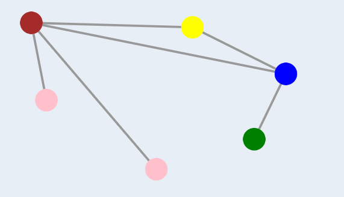

# Вершинная раскраска графа

## Определение
Раскраска графа - теоретико-графовая конструкция, при которой элементам графа ставятся в соответствие метки с учетом определенных ограничений.
Эти метки традиционнно называют цветами.

Правильная вершинная раскраска - раскраска вершин графа, при которой любые смежные вершины окрашены в разные цвета.

## Пример
  
*Все смежные вершины окрашены в разные цвета, раскраска правильная*

# Алгоритм

Для проверки правильности вершинной раскраски необходимо пройтись по списку рёбер графа и проверить, что концы каждого ребра окрашены в разные цвета.
