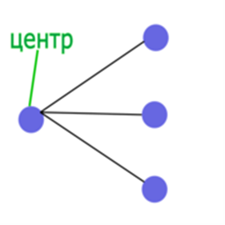

# wise-task-algorithms-2024

## 1. Реализация модуля
| Название модуля  | Имя студента разрабатывающего модуль | Имя студента тестирующего модуль | Капитан команды |
|------------------|------------------------------------|----------------------------------|-----------------|
| Множество вершин графа, являющееся центрами лап | Мещеряков Радомир | Медведский Даниил | Тищенко Артем   |

## 2. Лапа в графе
Лапой называется индуцированный подграф графа G, изоморфный двудольному графу K1,3

Центром лапы называется вершина степени три в лапе.

Пример:

## 3. Алгоритм
Данный модуль проверяет все ли отмеченные красным цветом вершины являются центрами лап
Модуль поддерживает только неориентированные графы. В начале работы создается ассоциативный массив вершин и ребер. Далее происходит обход вершин с поиском вершин степени 3. Если такая вершина найдена, то проверяется взаимная инцидентность связанных с центром вершин, если они не связаны между собой то вершина добавляется в список центров. Затем происходит сравнение указаных вершин и найденых. 
